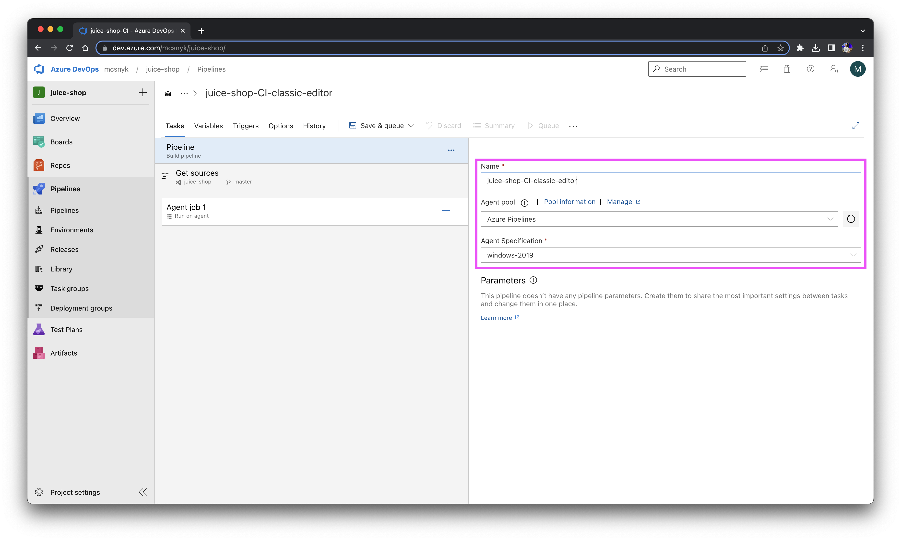
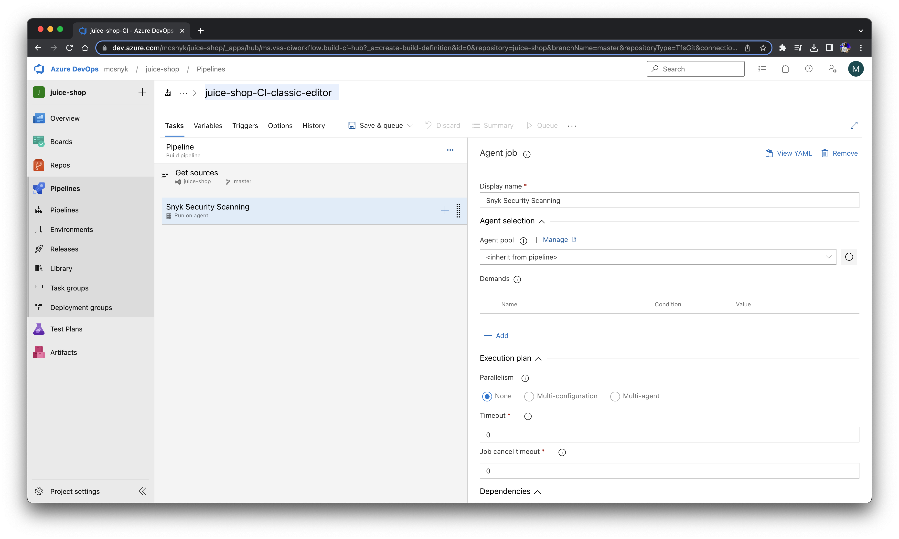

# Azure Pipelines - Classic Editor (pipeline without YAML)

One way to run Snyk in an Azure Pipeline can be achieved by installing the Snyk CLI using the <b><i>classic editor</i></b> to create a pipeline without YAML. 

## Workflow
- [ ] Create a new pipeline and on the <b><i>Connect</i></b> tab select the <b><i>Use the classic editor</i></b> option. 

- [ ] Select a source where you store your application data (<i>Azure Repos Git, GitHub, GitHub Enterprise Server, Subversion, Bitbucket Cloud and Other Git</i>).
In this example the application data is stored in an Azure Repos repository. 
Then, select the appropriate values for the fields <b><i>Team project</i></b>, <b><i>Repository</i></b> and <b><i>Default branch for manual and scheduled builds</i></b>. 

Click on continue 

- [ ] You may select a template, but in this workflow we'll start off an empty job (equivalent with the <b><i>Empty pipeline</i></b> tile) 

- [ ] In the next step we need to give our pipeline a <b><i>name</i></b> and select the <b><i>agent pool</i></b> and its <b><i>specification</i></b>. When you queue a build, it executes on an agent from the selected pool. You can select a Microsoft-hosted pool, or a self-hosted pool that you manage. In this example, we used a default agent pool and the <b><i>windows-2019</i></b> specification. 

- [ ] Let's configure the agent job next. We can give it a name, because of practical reasons we recommend using <i>"Snyk Security Scanning"</i> or similar. 
We will neither change the Agent Pool ("<i>\<inherit from pipeline></i>") nor add demands or parallelism to the pipeline execution.

