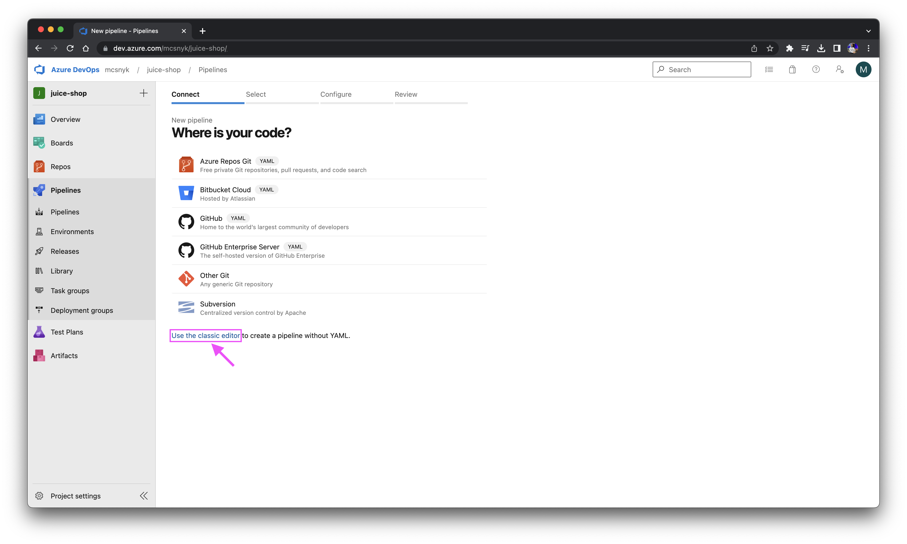
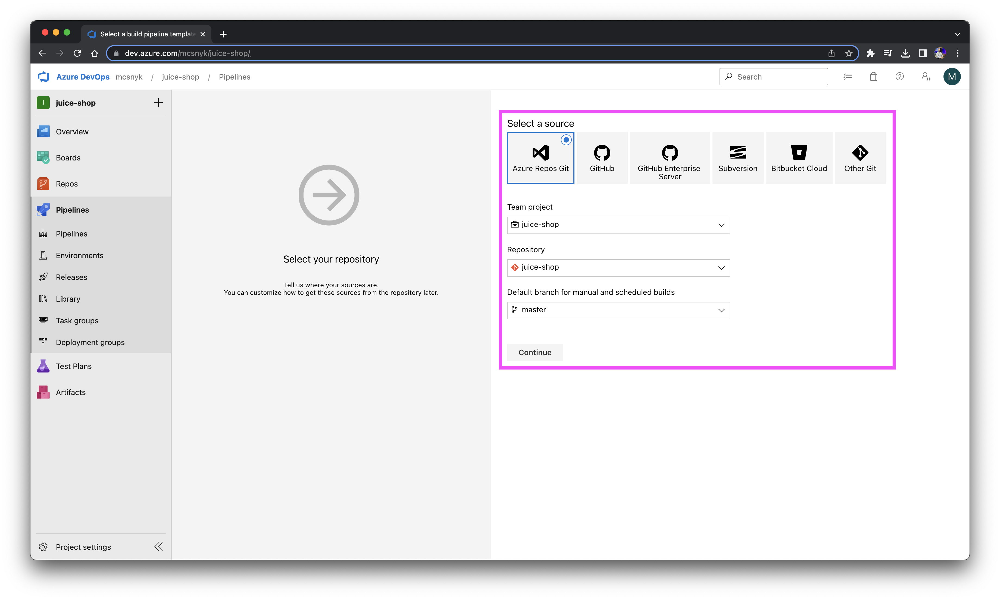
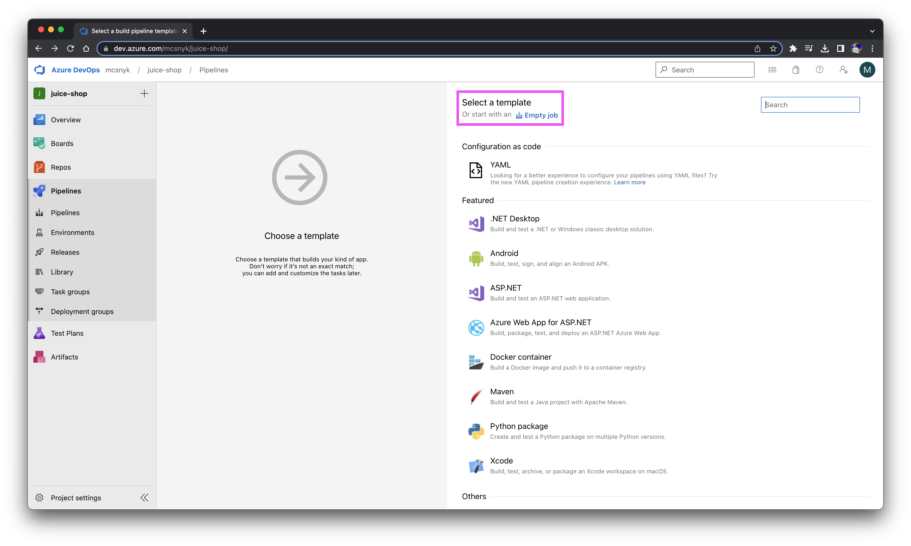

# Azure Pipelines - Classic Editor (pipeline without YAML)

One way to run Snyk in an Azure Pipeline can be achieved by installing the Snyk CLI using the <b><i>classic editor</i></b> to create a pipeline without YAML. 

## Workflow
- [ ] Create a new pipeline and on the <b><i>Connect</i></b> tab select the <b><i>Use the classic editor</i></b> option. 

- [ ] Select a source where you store your application data (<i>Azure Repos Git, GitHub, GitHub Enterprise Server, Subversion, Bitbucket Cloud and Other Git</i>).
In this example the application data is stored in an Azure Repos repository. 
Then, select the appropriate values for the fields <b><i>Team project</i></b>, <b><i>Repository</b></i> and <b><i>Default branch for manual and scheduled builds</b></i>. 

Click on continue 

- [ ] You may select a template, but in this workflow we'll start off an empty job (equivalent with the <b><i>Empty pipeline</i></b> tile) 

